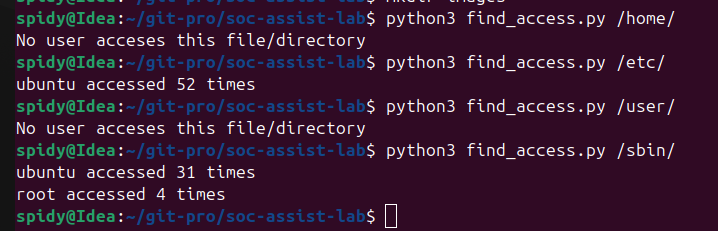
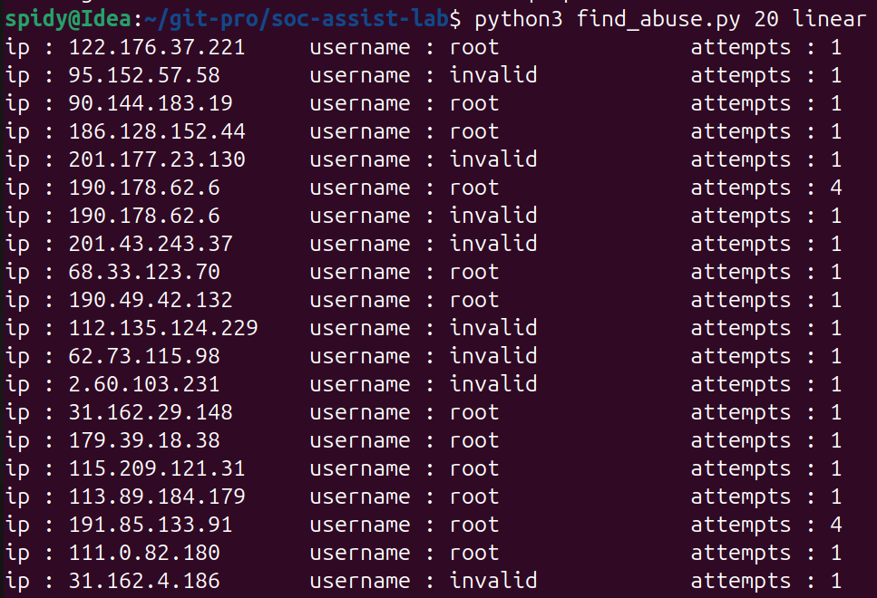
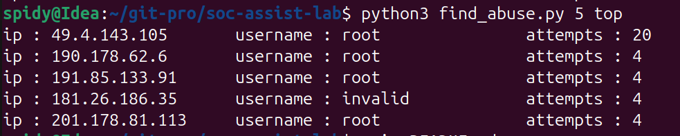

# ========= SOC ASSISTANT LAB ==========
This lab consists of three python-command line tools.  
which can be handy for any soc-analyst who work with particular log lines.
  
#### =================================  
### Before starting to use the authentication abuser tool or sudo access tool please ensure that  
The **write.py** needs to run before hand.  
The both tool access a separate log file **sudo.log** , **sshd.log** that have been separated from the source log file.  
The separation of those particular log file written as separate log file , considering future devlopment.    
  
#### =================
## **find_access.py** 
#### =================  
This command line help the soc to retrive the unique user , who uses a particular file or folder form the log file.  
  
Example usage 1:  
***python3 find_access.py /etc/passwd***    
    This command list a set up username list with the count of how much time they access the particular */etc/passwd* file.  
  
  
Example usage 2:  
From the above image you can see that a list of user who accessed the specific file with their no of access events are listed.  
Through this tool we can infer more specific upto the specific user level access for the particular file.  
***python3 find_access.py /usr ubuntu***  
But the real handy things is this method help to list down what are all the different privileages used by the user.  
  
  
#### =================  
## **find_abuse.py**  
#### =================  
This command line tool intended to list out the top abusers of our ssh server who logins attempt are invalid.  
Using this tool we can limit the number of abusers to list in linear or in top abusers (descending order).  
Example usage :  
***python3 find_abuse.py 20 linear***    
***python3 find_abuse.py 5 top***  
  
    

